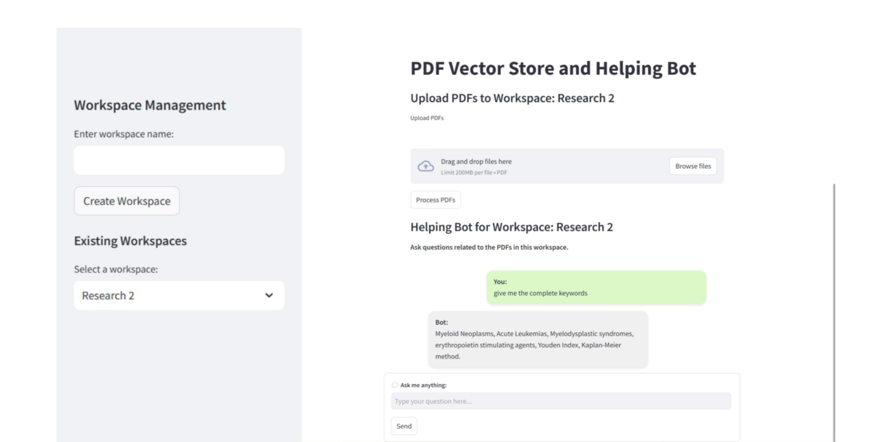

# PDF Vector Store and Helping Bot

This project allows you to manage PDF documents in dedicated workspaces and interact with them through a helpful bot powered by AI. The bot can answer questions based on the content of the uploaded PDFs, making it easier to retrieve information from large collections of documents.



## Features

### 1. **Workspace Management**
   - **Create Workspaces**: Organize your PDFs by creating workspaces. Each workspace acts as a separate container for PDFs.
   - **List Workspaces**: View all available workspaces to manage your documents more efficiently.
   - **Switch Between Workspaces**: Seamlessly switch between different workspaces to access PDFs and interact with the bot.

### 2. **PDF Upload and Indexing**
   - **Upload PDFs**: Easily upload PDFs into selected workspaces. All uploaded files are indexed and stored in a vector database for quick retrieval.
   - **PDF Processing**: Automatically process uploaded PDFs for search and query capabilities.

### 3. **Helping Bot**
   - **Ask Questions**: Use the built-in chatbot to ask questions related to the PDFs in the selected workspace.
   - **AI-Powered Responses**: Get instant answers based on the content of the PDFs, powered by a smart AI backend.
   - **Chat History**: The bot remembers past queries and responses, allowing you to easily refer to previous interactions.

### 4. **User-Friendly Interface**
   - **Interactive UI**: A clean and intuitive interface that allows you to manage workspaces, upload PDFs, and interact with the bot without hassle.
   - **Real-Time Updates**: The UI updates automatically when switching workspaces, making it easy to stay in context.

## How to Use

1. **Create a Workspace**: 
   - Enter a workspace name in the sidebar and click "Create Workspace." This will create a dedicated space for storing and interacting with your PDFs.

2. **Upload PDFs**: 
   - After selecting a workspace, upload your PDFs. The system will automatically index them for easy search and query.

3. **Ask the Bot**: 
   - Once PDFs are uploaded, you can interact with the bot. Simply type your question in the input box and hit "Submit." The bot will process the query and provide relevant answers based on the content of your PDFs.

4. **Switch Between Workspaces**: 
   - If you have multiple workspaces, you can easily switch between them. When switching, the bot will be context-aware and provide responses based on the PDFs in the selected workspace.

## 🚀 Installation  

Follow these steps to set up **Helping Bot** on your local machine:  

### 1⃣ Clone the Repository  
```bash
git clone https://github.com/incri/Helping-Bot.git
cd Helping-Bot
```

### 2⃣ Create and Activate a Virtual Environment  
#### On macOS/Linux:  
```bash
python -m venv venv
source venv/bin/activate
```
#### On Windows:  
```bash
python -m venv venv
venv\Scripts\activate
```

### 3⃣ Install Dependencies  
```bash
pip install -r requirements.txt
```

### 4⃣ Set Up Environment Variables  
Copy the example environment file:  
#### On macOS/Linux:  
```bash
cp .env copy .env
```
#### On Windows:  
```bash
copy .env copy .env
```

Now, open `.env` and update the required API keys:  
- **Pinecone API Key** → Get it from [Pinecone](https://www.pinecone.io/).  
- **MongoDB Connection String** → Create a database on [MongoDB Atlas](https://www.mongodb.com/atlas/database) or use a local instance.  
- **Google API Key** → Required credentials (refer to `.env.example`).  

### 5⃣ Run the Application  
```bash
streamlit run helping_bot/main.py
